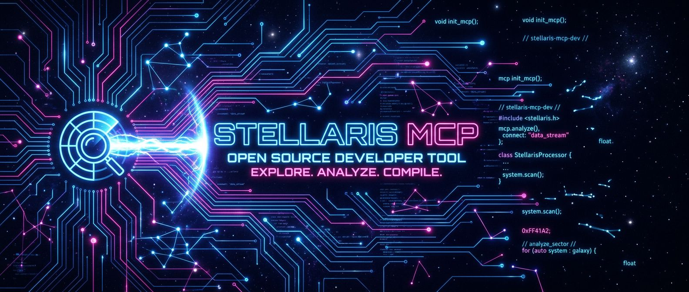

<p align="center">
  
</p>

# Stellaris MCP

> [English version](README.md)

Serveur MCP pour la recherche semantique dans le code et l'exploration structurelle de codebase via AST.

Combine la puissance des **embeddings vectoriels** (OpenAI + LanceDB) pour la recherche en langage naturel avec le **parsing AST** (tree-sitter) pour l'exploration precise des symboles.

## Fonctionnalites

- **Recherche semantique** dans le code et la documentation via embeddings
- **Exploration AST** : arbre de fichiers, outline de symboles, extraction de code source
- **Indexation incrementale** : seuls les fichiers modifies sont re-indexes
- **Securise par defaut** : aucune auto-indexation tant que vous n'avez pas lance `reindex` une premiere fois
- **Auto-indexation** aux demarrages suivants (opt-in via `.stellarisrc`)
- **23 extensions de fichiers** : TS, JS, Python, Go, Rust, PHP, HTML, CSS, Astro, Vue, Svelte, SCSS, JSON, YAML, SQL, GraphQL, Prisma, TOML, etc.
- **Documentation** : indexation et recherche dans les fichiers Markdown/MDX
- **Filtre par extension** : `search_code` accepte un parametre `extensions` pour cibler les resultats sur des types de fichiers specifiques
- **Contexte enrichi** : imports, symboles voisins et avertissements TODO/FIXME inclus automatiquement
- **Degradation gracieuse** : fonctionne sans `OPENAI_API_KEY` (les outils AST restent disponibles)

## Benchmark : Stellaris vs Grep/Glob

Teste sur un projet Astro reel (341 fichiers, 430 chunks indexes) :

| Metrique | Sans Stellaris | Avec Stellaris | Gain |
|----------|----------------|----------------|------|
| Appels d'outils (moy.) | 5.0 | **1.5** | **-70%** |
| Fichiers lus en entier (moy.) | 2.8 | **0** | **-100%** |
| Tokens consommes | ~12 000 | ~**2 500** | **-80%** |
| Precision | Variable (bruit dans les resultats grep) | **Elevee** (previews ciblees) | |

Stellaris excelle sur les questions complexes multi-fichiers (flux d'auth, logique de paiement, systemes i18n). Grep/Glob restent meilleurs pour les listings exhaustifs de fichiers. Strategie optimale : **Stellaris d'abord, Grep/Glob en complement**.

## Outils exposes (6)

### Recherche semantique (necessite OpenAI API)

| Outil | Description |
|-------|-------------|
| `search_code` | Recherche en langage naturel dans le code. Retourne fichiers, lignes et previews. Accepte un filtre `extensions` optionnel (ex: `[".ts", ".js"]`). |
| `search_docs` | Recherche en langage naturel dans la documentation Markdown. |
| `reindex` | Force la re-indexation incrementale du projet. Accepte `enable_auto_index` pour activer/desactiver l'auto-indexation. |

### Exploration structurelle (zero API call)

| Outil | Description |
|-------|-------------|
| `get_file_tree` | Arbre de fichiers du projet avec stats par langage. |
| `get_file_outline` | Liste les symboles d'un fichier avec lignes + imports, exports et avertissements TODO/FIXME. |
| `get_symbol` | Retourne le code source complet d'un symbole + contexte du fichier (imports, symboles voisins, avertissements). |

## Contexte enrichi automatique

Un piege classique des outils de recherche de code est de retourner des resultats **trop precis** — le LLM obtient la fonction demandee mais il lui manque le contexte necessaire pour prendre des decisions sures (imports, fonctions voisines, TODO).

Stellaris resout ce probleme avec un **enrichissement contextuel automatique** :

- **`get_symbol`** retourne le code source demande **plus** le contexte du fichier par defaut :
  - **Imports** — pour que le LLM sache d'ou viennent les dependances
  - **Symboles voisins** — noms et lignes des autres fonctions/classes du meme fichier, evitant les duplications et revelant les patterns
  - **Avertissements** — commentaires TODO, FIXME, HACK, NOTE, @deprecated trouves dans le fichier

- **`get_file_outline`** retourne les noms de symboles **plus** les imports et exports du fichier, pour comprendre le graphe de dependances avant de plonger dans le code.

Cela ajoute ~100-200 tokens de "bruit utile" par appel — bien moins cher que lire le fichier entier (~800-2000 tokens), tout en evitant les erreurs de refactoring a l'aveugle.

Le parametre `context` de `get_symbol` peut etre mis a `false` pour ne recevoir que le code brut.

### Exemple de reponse `get_symbol`

```json
{
  "file": "src/indexer/chunker.ts",
  "symbol": "chunkCodeAST",
  "lines": "299-380",
  "source": "function chunkCodeAST(content, file) { ... }",
  "file_context": {
    "imports": ["node:crypto", "tree-sitter", "../config/defaults.js"],
    "exports": ["chunkFile", "parseFileSymbols", "extractFileContext"],
    "siblings": [
      "function extractImports (261-285)",
      "function chunkMarkdown (382-429)",
      "function chunkCodeFallback (431-465)"
    ],
    "warnings": ["L42: TODO handle edge case for empty files"]
  }
}
```

## Workflow recommande

1. **`reindex`** pour indexer le projet la premiere fois (requis avant la recherche semantique)
2. **`get_file_tree`** pour decouvrir la structure du projet
3. **`search_code`** pour trouver des fonctionnalites par description naturelle
4. **`get_file_outline`** pour voir les symboles + imports/exports d'un fichier identifie
5. **`get_symbol`** pour recuperer le code exact avec le contexte environnant

Les etapes 2, 4, 5 ne consomment **aucun token d'API** — seule la recherche semantique utilise les embeddings OpenAI.

Apres le premier `reindex`, un fichier `.stellarisrc` est cree a la racine du projet avec `auto_index=true`. Les demarrages suivants du serveur lanceront automatiquement l'indexation incrementale (uniquement les fichiers modifies).

## Installation

```bash
git clone https://github.com/GDM-Pixel/stellaris-code-search.git
cd stellaris-code-search
npm install
npm run build
```

## Configuration

### Variables d'environnement

| Variable | Requis | Description |
|----------|--------|-------------|
| `OPENAI_API_KEY` | Pour recherche/indexation | Cle API OpenAI pour les embeddings (`text-embedding-3-small`) |

Sans `OPENAI_API_KEY`, le serveur demarre normalement — `get_file_tree`, `get_file_outline` et `get_symbol` fonctionnent sans.

### Fichier `.vectorconfig.json` (optionnel)

A la racine du projet indexe :

```json
{
  "include": ["src/**", "packages/**", "docs/**"],
  "exclude": ["node_modules/**", "dist/**", "**/*.test.ts"],
  "chunkStrategy": "ast"
}
```

### `.stellarisrc` (genere automatiquement)

Cree automatiquement apres le premier `reindex` reussi. Controle le comportement d'auto-indexation au demarrage du serveur.

```
# Stellaris Code Search configuration
# Set auto_index=true to enable automatic incremental indexing on startup
auto_index=true
```

Vous pouvez basculer cette option via l'outil `reindex` (`enable_auto_index: false`) ou editer le fichier manuellement. Supprimer le fichier desactive l'auto-indexation.

### Fichier `.vectorignore` (optionnel)

Meme syntaxe que `.gitignore`, pour exclure des fichiers de l'indexation.

## Integration Claude Desktop

```json
{
  "mcpServers": {
    "stellaris-mcp": {
      "command": "node",
      "args": ["C:/chemin/vers/stellaris-mcp/dist/index.js"],
      "env": {
        "OPENAI_API_KEY": "sk-..."
      }
    }
  }
}
```

## Langages et formats supportes

| Langage / Format | Extensions | Parsing | Types de symboles |
|------------------|-----------|---------|-------------------|
| TypeScript | `.ts` | tree-sitter (AST) | function, component, hook, class, type |
| TSX | `.tsx` | tree-sitter (AST) | function, component, hook, class, type |
| JavaScript | `.js` | tree-sitter (AST) | function, component, class |
| JSX | `.jsx` | tree-sitter (AST) | function, component, class |
| Python | `.py` | tree-sitter (AST) | function, class |
| Go | `.go` | tree-sitter (AST) | function, method, type |
| Rust | `.rs` | tree-sitter (AST) | function, struct, impl, trait, type |
| PHP | `.php` | tree-sitter (AST) | function, class, type |
| HTML | `.html` | tree-sitter (AST) | element |
| CSS | `.css` | tree-sitter (AST) | rule |
| Astro | `.astro` | fallback (chunked) | module |
| Vue | `.vue` | fallback (chunked) | module |
| Svelte | `.svelte` | fallback (chunked) | module |
| SCSS / Less | `.scss`, `.less` | fallback (chunked) | module |
| JSON | `.json` | fallback (chunked) | module |
| YAML | `.yaml`, `.yml` | fallback (chunked) | module |
| SQL | `.sql` | fallback (chunked) | module |
| GraphQL | `.graphql`, `.gql` | fallback (chunked) | module |
| Prisma | `.prisma` | fallback (chunked) | module |
| TOML | `.toml` | fallback (chunked) | module |
| Markdown | `.md`, `.mdx` | heading-based | doc_section |

## Architecture

```
src/
  index.ts              # Point d'entree MCP, declaration des outils
  startup.ts            # Auto-indexation au demarrage (lit .stellarisrc)
  config/
    defaults.ts         # Extensions, parametres de chunking, config LanceDB
    loader.ts           # Chargement de .vectorconfig.json
    stellarisrc.ts      # Lecture/ecriture de .stellarisrc
  indexer/
    scanner.ts          # Scan des fichiers du projet (.gitignore, .vectorignore)
    chunker.ts          # Parsing AST multi-langages + extraction de symboles
    embedder.ts         # Appels OpenAI embeddings (batch)
    hasher.ts           # Hash SHA-256 pour indexation incrementale
  store/
    lancedb.ts          # Stockage vectoriel LanceDB
  tools/
    searchCode.ts       # Outil search_code
    searchDocs.ts       # Outil search_docs
    reindex.ts          # Outil reindex
    getFileTree.ts      # Outil get_file_tree
    getFileOutline.ts   # Outil get_file_outline
    getSymbol.ts        # Outil get_symbol
```

## Stockage

L'index est stocke dans `.vectors/` a la racine du projet :
- `.vectors/lancedb/` — base vectorielle LanceDB
- `.vectors/meta.json` — meta-index des fichiers (hashes, chunks IDs, dates)

Ce dossier est automatiquement ignore par le scanner.

## Developpement

```bash
npm run dev    # Lancement avec tsx (hot reload)
npm run build  # Compilation TypeScript
npm run watch  # Compilation en mode watch
```

## Versions

**v2.3.0** — Filtre `extensions` sur `search_code` + benchmark + 23 extensions supportees.

**v2.2.0** — 13 nouvelles extensions : Astro, Vue, Svelte, SCSS, JSON, YAML, SQL, GraphQL, Prisma, TOML.

**v2.1.0** — Garde-fou : plus d'auto-indexation par defaut. `.stellarisrc` pour le controle opt-in.

**v2.0.0** — Ajout de get_file_tree, get_file_outline, get_symbol + support Python, Go, Rust, PHP, HTML, CSS.

## Licence

[MIT](LICENSE)
